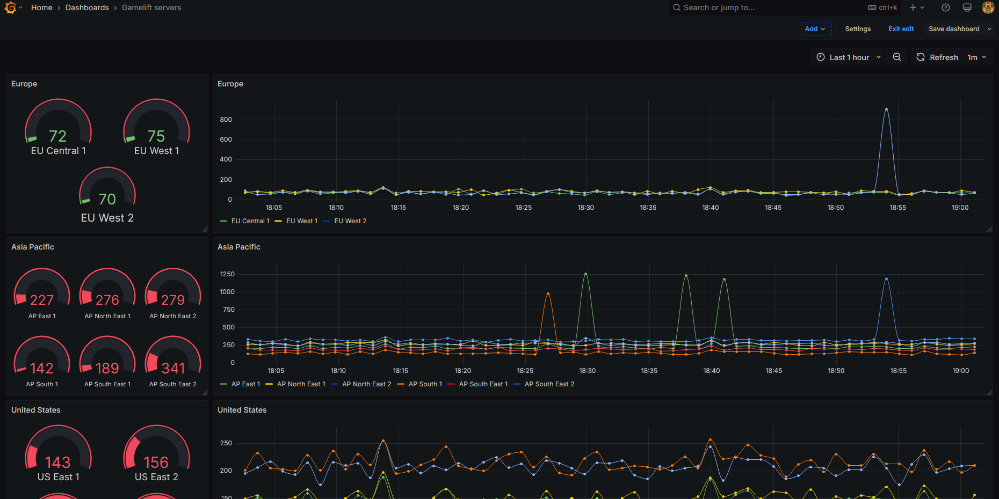

<div align="center">
  <h1>🕸️ Foggler</h1>

  
  
  

  <p><strong>Foggler keeps a constant watch on Gamelift AWS server connections, peeking through the fog</strong></p>
</div>


<div align="center">
  
</div>

---

## ℹ️ About

- This project is intended to be deployed on a server for monitoring via **Loki & Grafana**.
- Running it as a binary on your personal device might be overkill. Check the arguments first.
- Foggler fetches the servers one by one trying to reach them to determinate the latency

---

## 🐳 Container

### Requirements
- Docker

### Stack
- Grafana
- Loki
- Promtail
- Rust

### Environment Variables
```ini
GRAFANA_USERNAME=admin
GRAFANA_PASSWORD=i_am_not_stupid_to_set_admin_as_password
PORT=443
TIMEOUT=3
WAIT=600
```

### Deploy
[deploy.sh](./deploy.sh)

```sh
chmod +x deploy.sh
./deploy.sh
```

---

## 📊 Grafana

### Suggested Panel Setting
> **Graph styles** → Connect null values → Always

```sh
avg_over_time(
  {job="foggler"}
  | json
  | unwrap fields_ping
  [${__interval}]
) by (fields_server)
```

<p align="center">
  
  
</p>

---

### Output
```log
2025-04-23T10:11:00.196815850+00:00  INFO foggler::core: server="AP East 1" ping="236ms"
2025-04-23T10:11:00.196931278+00:00  INFO foggler::core: server="AP South 1" ping="121ms"
...
2025-04-23T10:11:00.197740966+00:00  INFO foggler::core: server="US West 2" ping="185ms"
```

---

## 🛠️ Rebuild
```sh
git clone git@github.com:Neotoxic-off/Foggler.git
cd Flogger/flogger
cargo build
```

---

## 🌐 Servers

[servers.toml](./servers.toml)

