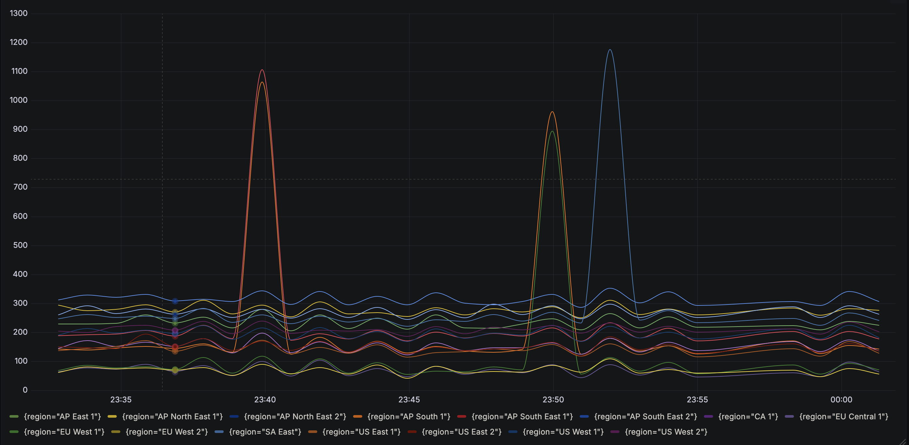

<div align="center">
  <h1>🕸️ Foggler</h1>

  
  
  

  <p><strong>Foggler keeps a constant watch on Dead by Daylight server connections, peeking through the fog</strong></p>
</div>


<div align="center">
  
</div>

---

## ℹ️ About

- This project is intended to be deployed on a server for monitoring via **Loki & Grafana**.
- Running it as a binary on your personal device might be overkill. Check the arguments first.
- Foggler fetches the servers one by one trying to reach them to determinate the latency

---

## 🐳 Container

### Requirements
- Docker

### Stack
- Grafana
- Loki
- Promtail
- Rust

### Environment Variables
```ini
GRAFANA_USERNAME=admin
GRAFANA_PASSWORD=i_am_not_stupid_to_set_admin_as_password
```

### Deploy
```sh
chmod 777 grafana
docker compose up --build
```

---

## 📊 Grafana

### Suggested Panel Setting
> **Graph styles** → Connect null values → Always

```bash
avg_over_time(
  {job="foggler"}
  | json
  | unwrap ping
  [${__interval}]
) by (server)
```

<p align="center">
  
</p>

---

## 🔧 Binary

### Usage
```sh
Foggler keeps a constant watch on Dead by Daylight server connections

Usage: foggler [OPTIONS] --servers <SERVERS>

Options:
  -s, --servers <SERVERS>  List of servers to ping
  -t, --timeout <TIMEOUT>  Time limit to wait before timeout [default: 3]
  -p, --port <PORT>        Port to ping [default: 443]
  -w, --wait <WAIT>        Waiting time in sec between checks (0 for one-time) [default: 600]
  -l, --logs <LOGS>        Logs folder for monitoring [default: logs]
  -h, --help               Print help
  -V, --version            Print version
```

### Example
```sh
./foggler --servers servers.toml --wait 0
```

### Output
```log
2025-04-23T10:11:00.196815850+00:00  INFO foggler::core: server="AP East 1" ping="236ms"
2025-04-23T10:11:00.196931278+00:00  INFO foggler::core: server="AP South 1" ping="121ms"
...
2025-04-23T10:11:00.197740966+00:00  INFO foggler::core: server="US West 2" ping="185ms"
```

---

## 🛠️ Rebuild
```sh
git clone git@github.com:Neotoxic-off/Foggler.git
cd Flogger/flogger
cargo build
```

---

## 🌐 Servers

```toml
[[servers]]
name = "AP East 1"
url = "ec2.ap-east-1.amazonaws.com"

[[servers]]
name = "AP South 1"
url = "gamelift.ap-south-1.amazonaws.com"

[[servers]]
name = "AP North East 1"
url = "gamelift.ap-northeast-1.amazonaws.com"

[[servers]]
name = "AP North East 2"
url = "gamelift.ap-northeast-2.amazonaws.com"

[[servers]]
name = "AP South East 1"
url = "gamelift.ap-southeast-1.amazonaws.com"

[[servers]]
name = "AP South East 2"
url = "gamelift.ap-southeast-2.amazonaws.com"

[[servers]]
name = "CA 1"
url = "gamelift.ca-central-1.amazonaws.com"

[[servers]]
name = "EU Central 1"
url = "gamelift.eu-central-1.amazonaws.com"

[[servers]]
name = "EU West 1"
url = "gamelift.eu-west-1.amazonaws.com"

[[servers]]
name = "EU West 2"
url = "gamelift.eu-west-2.amazonaws.com"

[[servers]]
name = "SA East"
url = "gamelift.sa-east-1.amazonaws.com"

[[servers]]
name = "US East 1"
url = "gamelift.us-east-1.amazonaws.com"

[[servers]]
name = "US East 2"
url = "gamelift.us-east-2.amazonaws.com"

[[servers]]
name = "US West 1"
url = "gamelift.us-west-1.amazonaws.com"

[[servers]]
name = "US West 2"
url = "gamelift.us-west-2.amazonaws.com"
```
